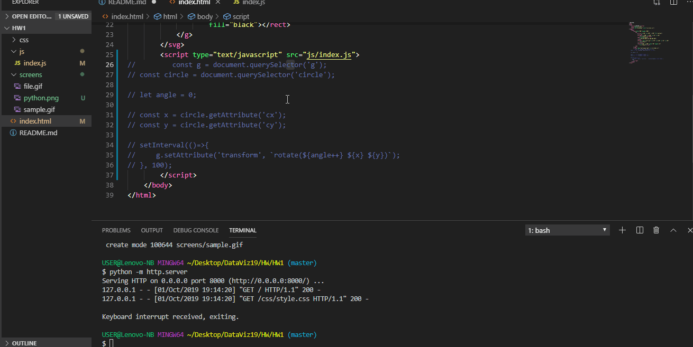
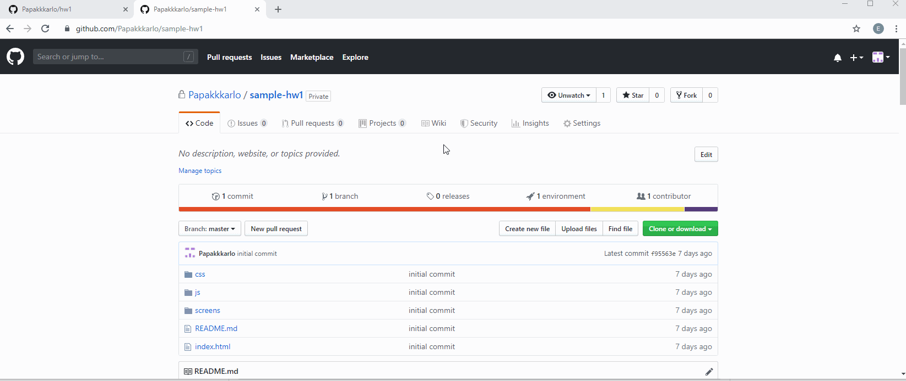

# HW 1
## Подготовка
В качестве основы для выполнения домашний работы возьмем код, разработанный на практическом занятии.

Для начала создайте приватный репозиторий на `github`.
Перейдите в папку на своем компьютере, в которой вы бы хотел хранить домашнии работы.
Скопируйте ссылку для клонировая со страницы этого репозитория.
Теперь нужно открыть специальную консоль. Для этого щелкните внутри папки правой кнопкой мыши и выберете в меню пункт ``Git Bash Here`` (Этот пунк появится там после установки git. По установки и настройти git есть пункт в Практике 1.
Введите в консоли:
```
$ git clone <ссылка>
```
Эта команда клонирует этот репозиторий в текущую папку. После ее завершения вы можете либо
перейти в папку с проектом и запустить сервер в той же консоли:
```
$ cd hw1
# для python 2
$ python -m SimpleHTTPServer
# для python 3
$ python -m http.server
```
Либо открыть эту папку при помощи VisualStudio Code и запустить сервер в открывшемся там терминале.

Если у вас возникнут проблемы с запуском тестового сервера (ошибки типа `python not in path`), можно попробовать переустановить python, отметив при установки что бы установщик сам добавил `python.exe` в `PATH`:

После чего пожно будет использовать `python` в коммандной строке.

В крайнем случае мы можем получить доступ к нашим файлам по протоколу `file://`, примерно вот так:

До тех пор пока нам не требуется выполнять ассинхронные запросы, к примеру для получения данных, мы можем тестировать код таким образом.

## Задание
Необходимо создать чекбокс при переключении которого:
1. Будет меняться лейбл чекбокса: ``Happy/Sad``
2. Будет меняться положение элемента ``<path>``

В конечном итоге приложение должно работать примерно следующим образом:


Поскольку здесь мы имеем два возможных состояния элементов, этом может быть реалирзовано
без использования JavaScript.
Вот [ссылка](https://css-tricks.com/transforms-on-svg-elements/) на полезную статью с примерами, по трансформации svg-элементов.

**Реализовать это нужно на чистом JavaScript и/или CSS без использования сторонних библиотек.**

## Отправка на проверку
После того как вы внесли изменения в шаблон и убедились что все работает нужно отправить изменения обратно на GitHub.
Для этого нужно сделать ``commit``. Это можно сделать при помощи интерфейса VS Code, или быстрее, при помощи консоли. Для этого остановите питоновский сервер при помощи ``Ctrl+C`` и введите в консоли следующие команды:
```
$ git add -A
$ git commit -m "My commit message"
$ git push
```
Первая команда добовляет изменения во всех файлах к предстоящему коммиту, вторая создает коммит, третья отправляет коммит на GitHub.

Сделать коммит можно и без помощи git, средствами GitHub.

После того как ваши изменения появились на GitHub остается только активировать `GitHub Pages` для вашего репозитория. Это можно сделать в настройках репозитория в пункте `GitHub Pages` указать в дропдауне `master branch`:


Когда все будет сделано, для проверки отправте ссылку на страницу на `GitHub Pages` мне в телеграмм @PapaKKKarlo или на почту egoriv1802@gmail.com
